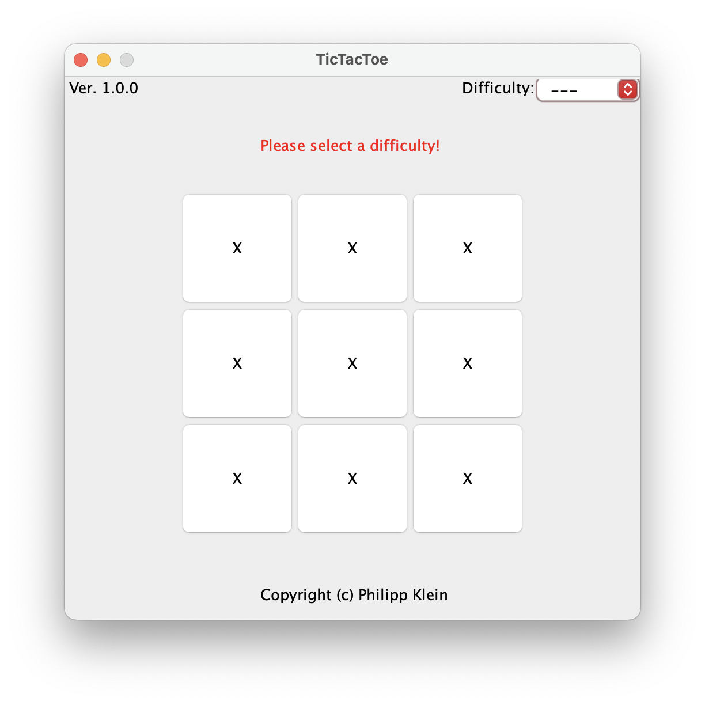
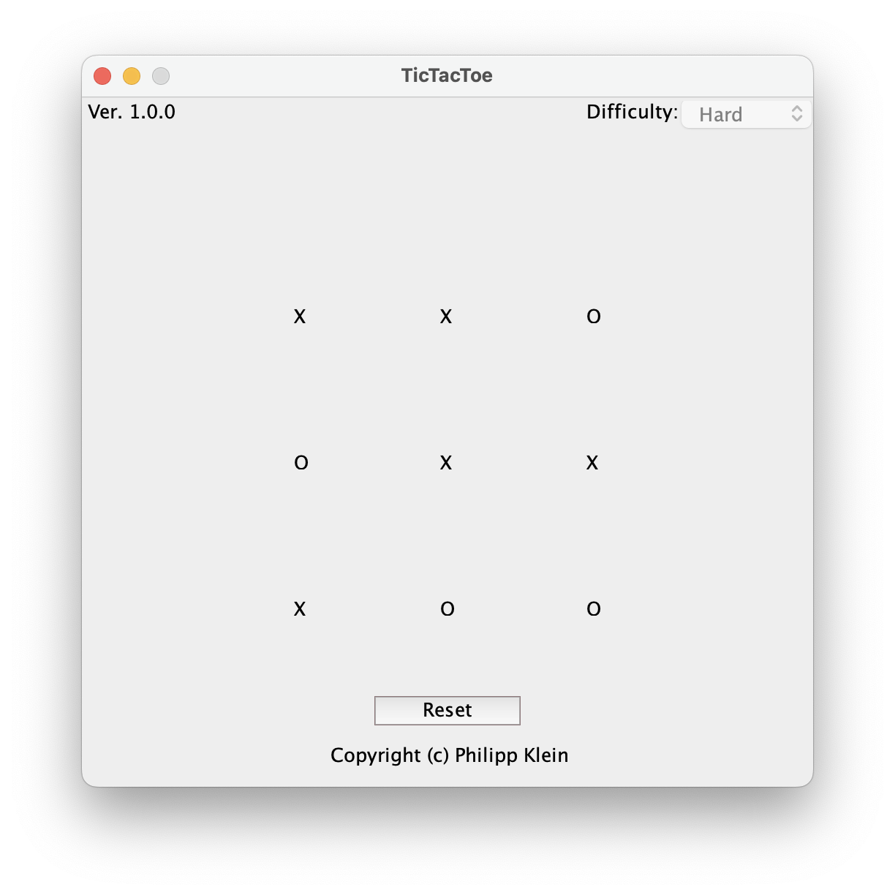

<h1>TicTacToe</h1>
<i>Published on: Thursday, 08.24.2023 </i>
<i>Languages: Java </i>
<i>Version: 1.0 </i>
 

[Get Documentation](documents/TicTacToe_Documentation.pdf)

This program allows you to play TicTacToe against a computer on a 3x3 board. The user interface is made using JFrames.

On the top right, you can select the level of difficulty. It ranges between: Easy, Normal and Hard. If you have selected a difficulty, you can start the game just by selecting a field and making your first move.

You cannot change the difficulty during a game or restart it. You have to finish the game first.

When the game has ended, it'll be indicated by the 'Reset' button, that appears at the bottom of the screen.
