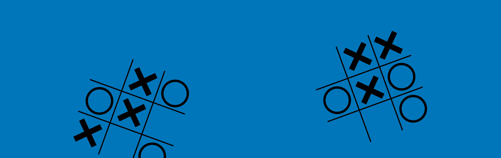

# TicTacToe
This program allows you to play Tic-tac-toe against a computer with three levels of difficulty: Easy, Normal and Hard. The user interface is made using JFrames. If you want to know everything about this program, I've made a PDF, that you can access here (GitHub): [Documentation](documents/TicTacToe_Documentation.pdf)
